# scheduler
Spring REST API using Spring Data Mysql

Implementation of a small working coding exercise by using the following technology stack: Java, MySQL, Hibernate, Rest API, Spring core

PostMan Results for Below given requirements. Complete Requirement document is checked in root directory

a. Add a restriction to a panel 
b. Read a restriction from a panel 
c. Delete a restriction from a panel 
d. Update a restriction from a panel 
e. Add a panel to a region 
f. Read a panel from a region 
g. Delete a panel from a region

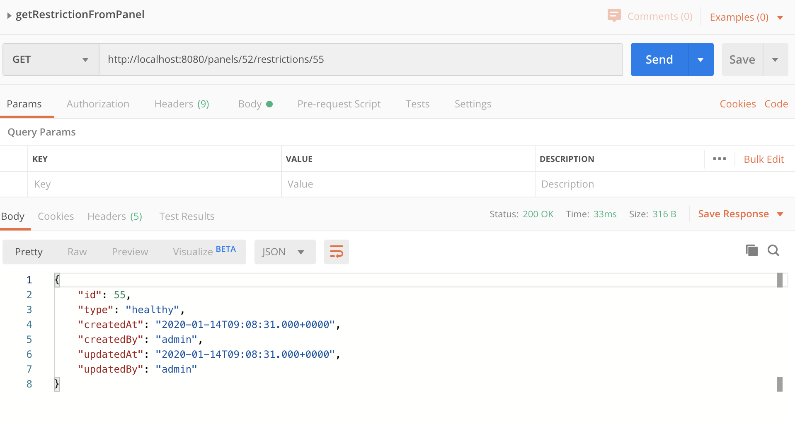

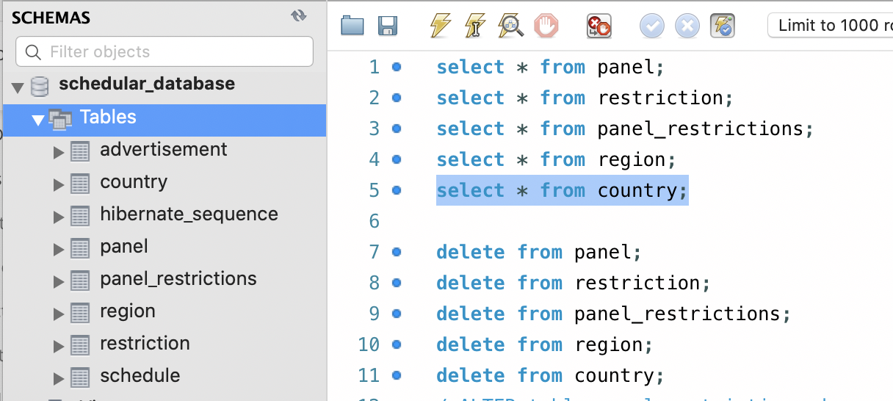

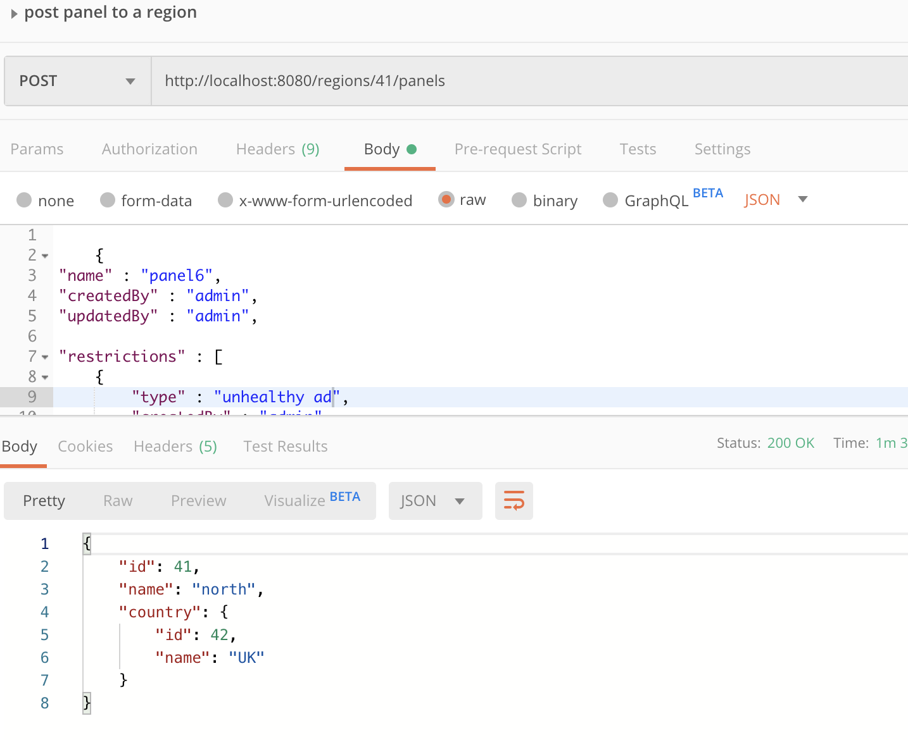

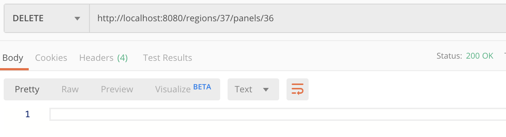

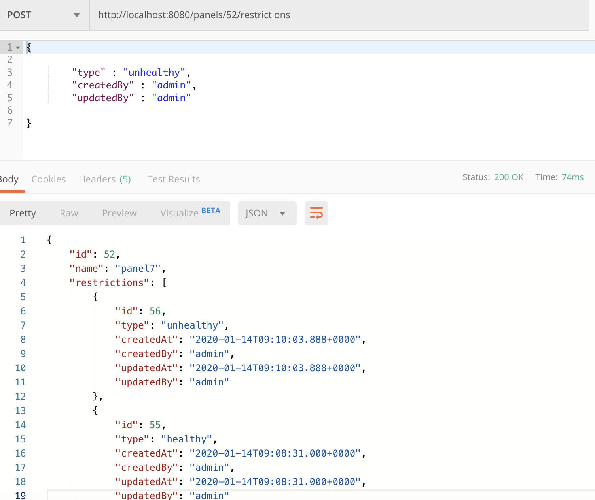

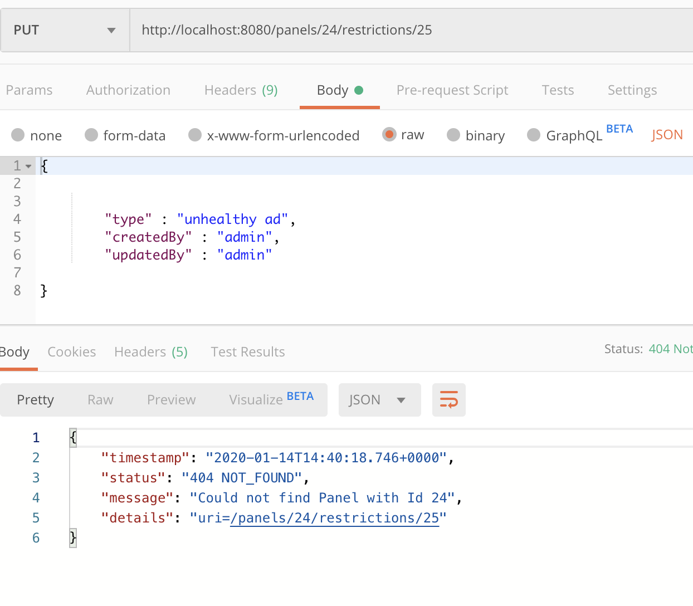

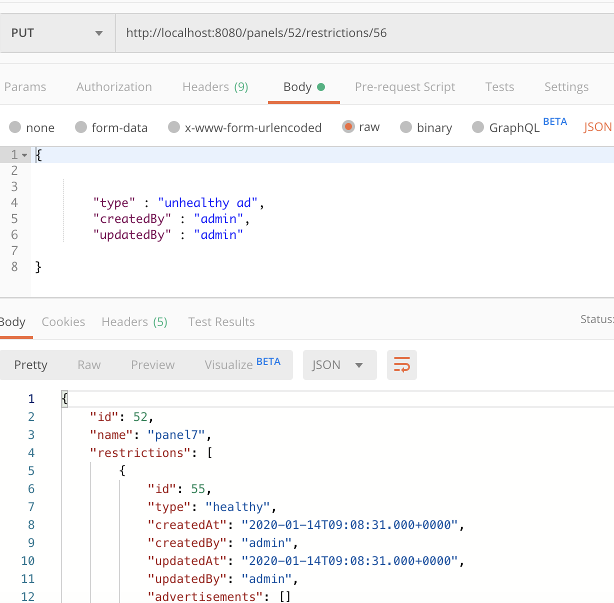

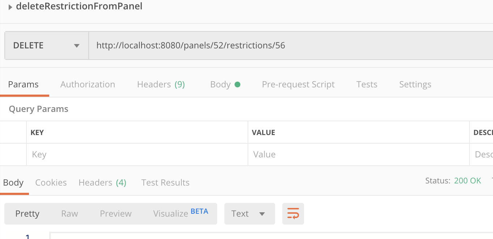

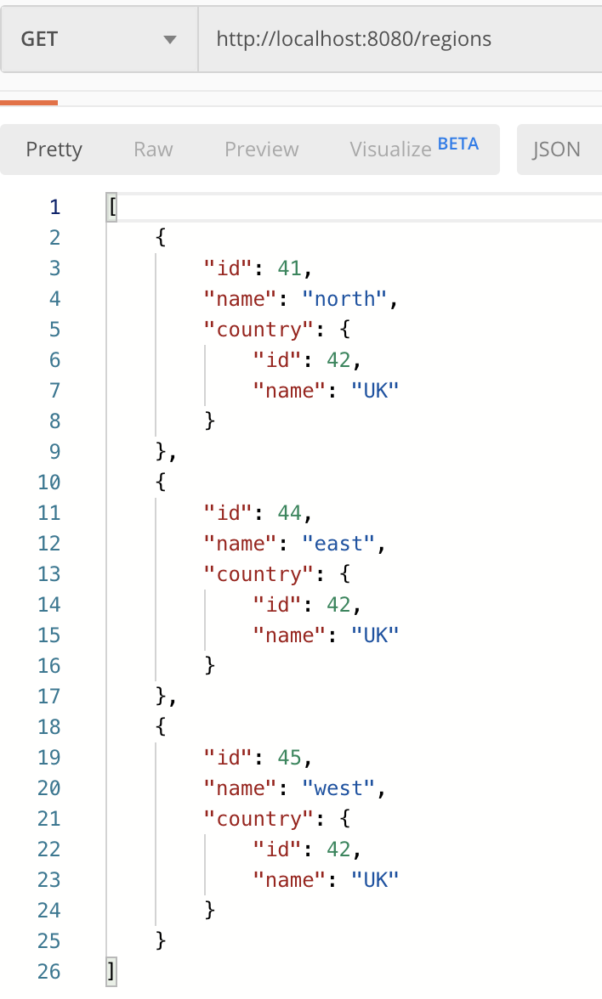

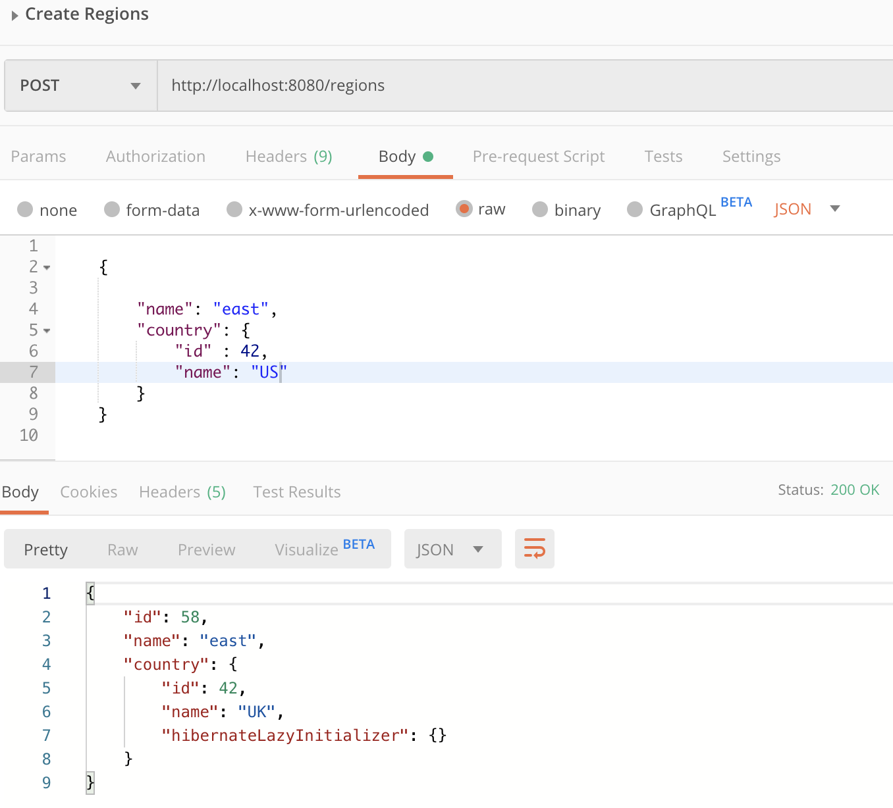

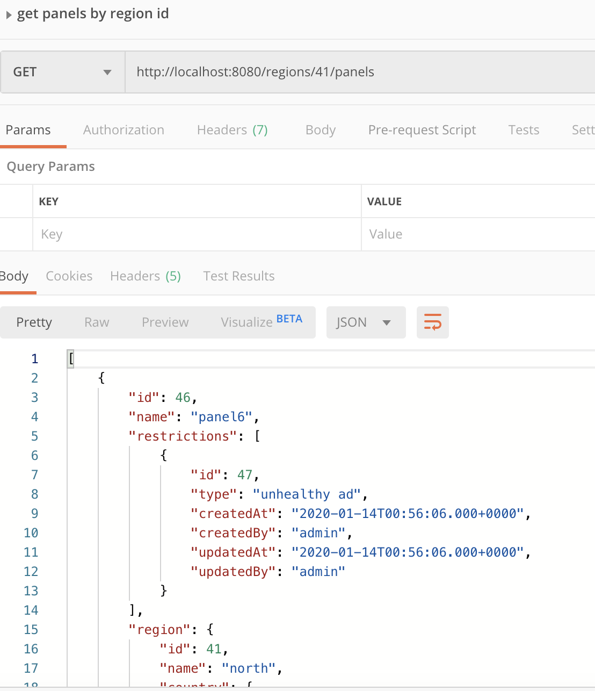

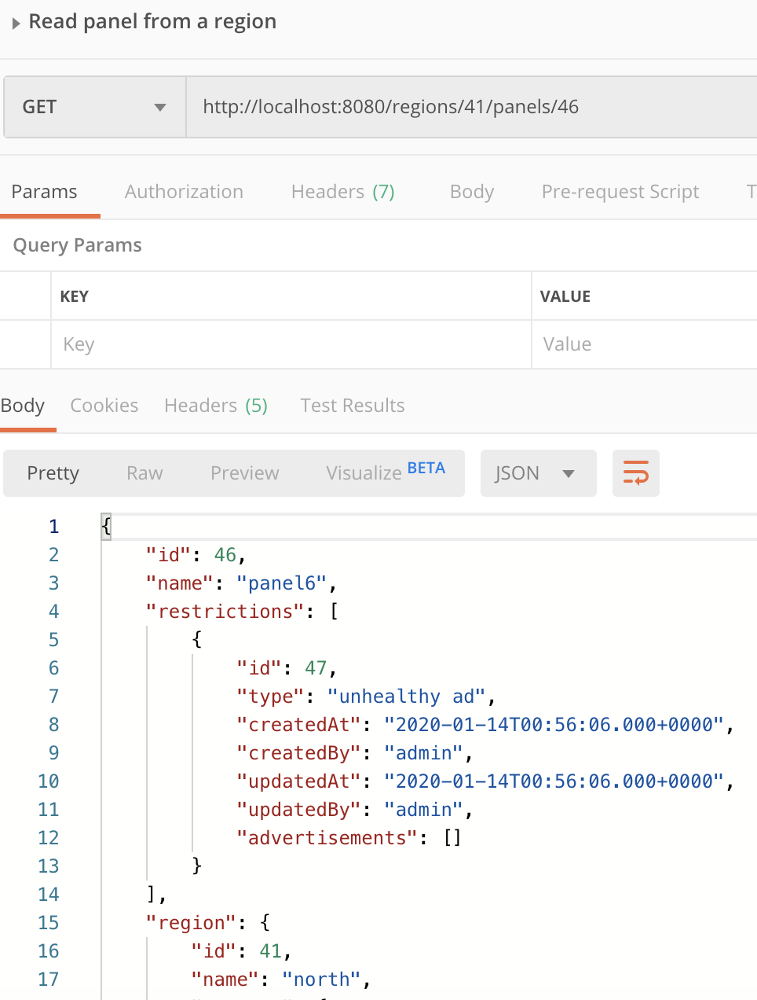
